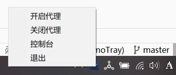

## 预览

## 用途
- 仅适用于windows系统；
- 仅会创建一个托盘程序用于控制开启代理和内核，以及打开控制台；
- 适合裸核使用mihomo的情况，py脚本中开头的配置项需要根据实际情况修改；
- 推荐通过运行MihomoTray.bat的方式运行，这样没有驻留的窗口，调试可用在logs下的日志；
- 托盘icon借用的CFW项目的，可自行修改
- 通过将pystray替换成这个https://github.com/xfangfang/pystray.git这个二开过的，可以支持左键打开菜单
- 觉得有用的话还请点点star，拜谢。
